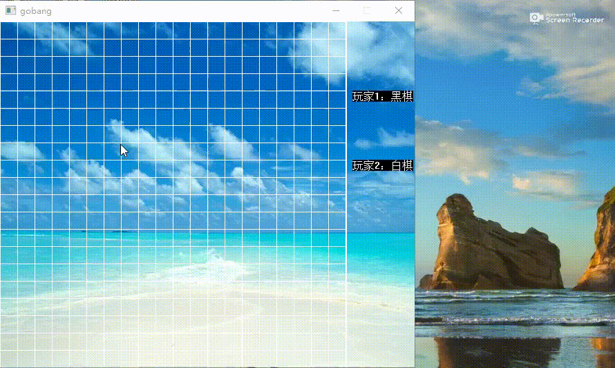

#### C++实现五子棋项目
***
##### 开发时间：2019.07.26
##### 开发者：Summer
##### 开发工具：Visual studio 2019
***
[一、演示效果](#1)

[二、头文件](#2)

[三、主函数](#3)

[四、画出棋盘](#4)

[五、下棋](#5)

[六、判断输赢](#6)

***
<h4 id='1'>一、演示效果</h4>



***
<h4 id='2'>二、头文件</h4>

```cpp
#include<stdio.h>
#include<graphics.h>	//图形库头文件
#include<mmsystem.h>	//播放音乐头文件
#include<math.h>

#pragma comment(lib, "winmm.lib")	//播放音乐库文件

int flag = 0;	//表示下棋次数
int board[20][20] = { 0 };	//0表示棋盘没有棋子状态

void initGame();
int judge(int a, int b);
void playChess();
```
***
<h4 id='3'>三、主函数</h4>

```cpp
int main() {

	initGame();
	playChess();

	getchar();
	return 0;
}
```
***
<h4 id='4'>四、画出棋盘</h4>

```cpp
//1.画出棋盘
void initGame() {		//初始化游戏

	//1.1 绘图环境 库函数
	//默认调用系统的窗口
	initgraph(600, 500);	//创建自定义窗口
	//setbkcolor(BLUE);	//设置窗口背景颜色
	//cleardevice();	//刷新

	//1.2 贴图
	loadimage(NULL, "./src/bg.jpg");

	//1.3 背景音乐	mci 多媒体控制结口
	mciSendString("open ./src/skyCity.mp3", 0, 0, 0);
	//mciSendString("play ./src/skyCity.mp3", 0, 0, 0);

	//setlinecolor(BLACK);
	//1.4 绘制棋盘
	//画线 20 20 25 25 500 500
	for (int i = 0; i <= 500; i+=25) {
		line(0, i, 500, i);
		line(i, 0, i, 500);
	}
	line(501, 0, 501, 500);

	//1.5 print out
	outtextxy(510, 100, "玩家1：黑棋");
	outtextxy(510, 200, "玩家2：白棋");
}
```


***
<h4 id='5'>五、下棋</h4>

```cpp
//2.下棋
void playChess() {
	//鼠标
	MOUSEMSG m;	//保存鼠标消息
	int x=0, y=0;	//坐标
	int a=0, b=0;	//行列

	//持续下棋
	while (1) {
		m = GetMouseMsg();	//获取一个鼠标消息

		//获取离鼠标最近的点的坐标信息
		for (int i = 1; i < 20; i++) {
			for (int j = 1; j < 20; j++) {
				if (abs(m.x - i * 25) < 12 && abs(m.y - j * 25) < 12) {
					x = i * 25;
					y = j * 25;
					a = i;
					b = j;
				}
			}
		}


		if (m.uMsg == WM_LBUTTONDOWN) {
			//棋子重复下在一个位置上
			if (board[a][b] != 0) {
				MessageBox(NULL, "这里已经有棋子了，请重新选择。", "提示", MB_OK);	//弹出一个提示框
				continue;	//进入下一循环
			}

			//判断黑白子
			if (flag % 2 == 0) {	//	偶数次 黑子
				setfillcolor(BLACK);
				solidcircle(x, y, 10);
				board[a][b] = 1;
			}
			else {	//奇数次
				setfillcolor(WHITE);
				solidcircle(x, y, 10);
				board[a][b] = 2;
			}
			flag++;
		}

		if (judge(a, b)) {
			if (flag % 2 == 0) {
				MessageBox(NULL, "玩家2胜利。", "游戏结束", MB_OK);	//弹出一个提示框
				exit(0);
			}
			else {
				MessageBox(NULL, "玩家1胜利。", "游戏结束", MB_OK);	//弹出一个提示框
				exit(0);
			}
		}
	}
}   
```

***
<h4 id='6'>六、判断输赢</h4>

```cpp
//3.判断输赢
int judge(int a, int b) {
	int i, j;
	int t = 2 - flag % 2;	//1 判断黑子是否赢	2 判断白子是否赢

	//横向
	for (i = a - 4, j = b; i <= a; i++) {
		if (i > 0 && i < 16 && t == board[i][j] && t == board[i + 1][j] && t == board[i + 2][j] && t == board[i + 3][j] && t == board[i + 4][j]) {
			return 1;
		}
	}

	//纵向
	for (i = a, j = b - 4; j <= b; j++) {
		if (j > 0 && j < 16 && t == board[i][j] && t == board[i][j + 1] && t == board[i][j + 2] && t == board[i][j + 3] && t == board[i][j + 4]) {
			return 1;
		}
	}

	//右下
	for (i = a - 4, j = b - 4; i <= a, j <= b; i++, j++) {
		if (i > 0 && i < 16 && j > 0 && j < 16 && t == board[i][j] && t == board[i + 1][j + 1] && t == board[i + 2][j + 2] && t == board[i + 3][j + 3] && t == board[i + 4][j + 4]) {
			return 1;
		}
	}

	//左下
	for (i = a - 4, j = b + 4; i <= a, j >= b; i++, j--) {
		if (i > 0 && i < 16 && j > 0 && j < 16 && t == board[i][j] && t == board[i + 1][j - 1] && t == board[i + 2][j - 2] && t == board[i + 3][j - 3] && t == board[i + 4][j - 4]) {
			return 1;
		}
	}

	return 0;
}
```
***
